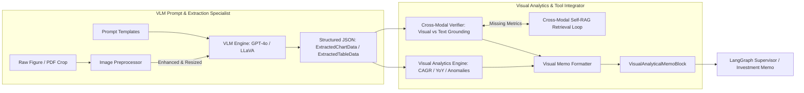
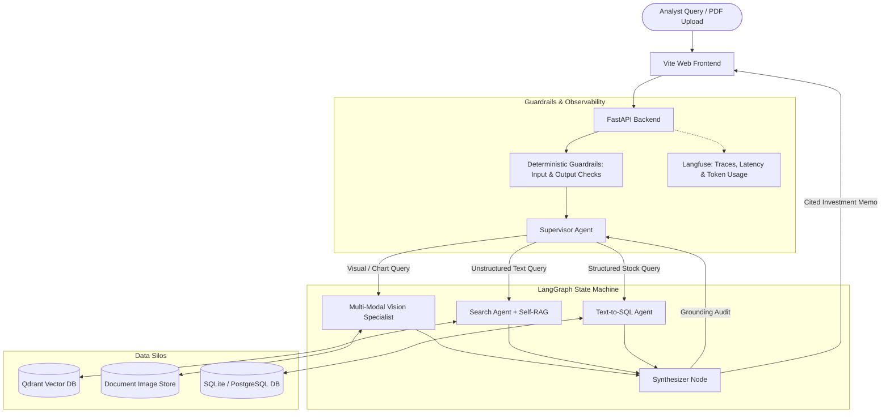

# 🧠 OmniBrain: Agentic Multi-Modal RAG Orchestrator

[](https://www.python.org/downloads/)
[](https://github.com/langchain-ai/langgraph)
[](https://fastapi.tiangolo.com/)
[](https://vitejs.dev/)
[](https://qdrant.tech/)
[]()
[](https://langfuse.com/)
[]()
[]()

> **OmniBrain** is an enterprise-grade, hallucination-resistant **Agentic Multi-Modal RAG (Retrieval-Augmented Generation)** platform designed for financial and quantitative research over complex enterprise PDFs containing financial statements, balance sheet tables, trend charts, bar graphs, and unstructured textual disclosures.

---

## 📌 Table of Contents
- [Executive Overview & Problem Statement](#-executive-overview--problem-statement)
- [Enterprise Use Case: Quantitative Analyst Workflow](#-enterprise-use-case-quantitative-analyst-workflow)
- [Team Pod Roles & Ownership](#-team-pod-roles--ownership)
- [Multi-Modal Vision Specialist Architecture (Deep Dive)](#-multi-modal-vision-specialist-architecture-deep-dive)
  - [2A. VLM Prompt & Vision Extraction Pipeline](#2a-vlm-prompt--vision-extraction-pipeline)
  - [2B. Visual Analytics & Multi-Modal Tool Integration](#2b-visual-analytics--multi-modal-tool-integration)
- [System Architecture](#-system-architecture)
- [LangGraph Multi-Agent State Graph](#-langgraph-multi-agent-state-graph)
- [API Reference (FastAPI Backend)](#-api-reference-fastapi-backend)
- [Evaluation, Observability & Guardrails](#-evaluation-observability--guardrails)
- [Repository Structure](#-repository-structure)
- [Quickstart Guide](#-quickstart-guide)
- [Running Automated Benchmarks & Tests](#-running-automated-benchmarks--tests)
- [License](#-license)

---

## 📖 Executive Overview & Problem Statement

Standard Retrieval-Augmented Generation (RAG) pipelines fail when applied to complex corporate annual reports and financial filings:
1. **Multi-Modal Blindspots**: Naive text extraction strips out or mangles graphical data (quarterly revenue bar charts, margin progression curves, segment breakdowns, and financial statement tables).
2. **Data Silos & Fragmented Reasoning**: Quantitative analysts must combine textual risk disclosures with structured market databases (historical stock prices, P/E multiples, 52-week highs/lows) and visual chart metrics.
3. **Hallucination & Lack of Grounding**: Standard LLMs frequently generate fabricated growth rates or misattribute numbers from adjacent table cells when not grounded in source citations.

**OmniBrain** solves this with an agentic architecture:
- **Supervisor Agent (LangGraph)**: Dynamically decomposes multi-hop research queries and routes sub-tasks across specialized agents.
- **Multi-Modal Vision Specialist (GPT-4o / LLaVA)**: Extracts structured data from visual figures and tables, runs quantitative trend calculations (CAGR, YoY growth), and cross-references visual metrics against text context.
- **Semantic RAG & Search Agent (Qdrant + Self-RAG)**: Retrieves vector chunks and autonomously loops to rewrite queries if retrieved context is insufficient.
- **Text-to-SQL Agent (Gemini 1.5 Pro)**: Queries structured relational databases for market benchmarks, valuations, and trading multiples.
- **Hallucination Guardrails & Telemetry (Langfuse)**: Enforces domain boundaries, prevents prompt leakage, and traces latency, token usage, and faithfulness down to the individual sub-agent level.

---

## 💼 Enterprise Use Case: Quantitative Analyst Workflow

```text
       ┌─────────────────────────────────────────────────────────┐
       │   500-Page Corporate Financial PDF (10-K / Annual)      │
       └────────────────────────────┬────────────────────────────┘
                                    │
                                    ▼
       ┌─────────────────────────────────────────────────────────┐
       │             OmniBrain Ingestion Pipeline                │
       │   • Text Chunker & Section Hierarchy Parser             │
       │   • Embedded Image & Visual Figure Extractor            │
       │   • Qdrant Vector Embeddings (Dense & Multimodal)       │
       └────────────────────────────┬────────────────────────────┘
                                    │
                                    ▼
       ┌─────────────────────────────────────────────────────────┐
       │             LangGraph Supervisor Orchestrator           │
       │   • Intent Classifier & Dynamic Query Routing           │
       └──────┬─────────────────────┼─────────────────────┬──────┘
              │                     │                     │
              ▼                     ▼                     ▼
   ┌────────────────────┐ ┌───────────────────┐ ┌───────────────────┐
   │    Search Agent    │ │   Vision Agent    │ │     SQL Agent     │
   │  • Semantic Search │ │ • VLM Extraction  │ │ • Text-to-SQL     │
   │  • Self-RAG Loops  │ │ • Visual Analytics│ │ • P/E, Market Cap │
   │  • Page Citations  │ │ • Cross-Modal Check│ │ • Stock Pricing  │
   └──────────┬─────────┘ └─────────┬─────────┘ └─────────┬─────────┘
              │                     │                     │
              └─────────────────────┼─────────────────────┘
                                    │
                                    ▼
       ┌─────────────────────────────────────────────────────────┐
       │           Synthesizer & Verification Node               │
       │   • Mathematical Derivatives (CAGR, YoY Growth, Trajectory)
       │   • Cross-Modal Discrepancy & Hallucination Audit       │
       │   • Cited Investment Research Memorandum Synthesis      │
       └────────────────────────────┬────────────────────────────┘
                                    │
                                    ▼
       ┌─────────────────────────────────────────────────────────┐
       │   Executive Investment Memo + Visual Citation Overlays  │
       └─────────────────────────────────────────────────────────┘
```

---

## 👥 Team Pod Roles & Ownership

The project is structured into specialized engineering pods:

### 🌟 The Agentic AI & Reasoning Pod
- **Role 1: Lead Agentic Architect** — LangGraph state machine, state definitions (`AgentState`), memory management, and supervisor routing.
- **Role 2: Multi-Modal Vision Specialist** *(Our Module)*:
  - **2A: VLM Prompt & Vision Extraction Specialist**: Prompt engineering, system directives, image preprocessing, and structured JSON parsing (`ExtractedChartData`, `ExtractedTableData`) across GPT-4o, Ollama/LLaVA, and mock engines.
  - **2B: Visual Analytics & Multi-Modal Tool Integrator**: Downstream mathematical reasoning (CAGR, YoY deltas, anomaly detection), cross-referencing visual numbers against text context, Self-RAG fact-checking loops, and investment memo block formatting.
- **Role 3: RAG & Search Engineer** — Semantic vector retrieval, hybrid search pipelines, iterative Self-RAG query rewriting, and document citation mapping.

### 🛡️ The Data, Safety & Full-Stack Pod
- **Role 4: Multi-Modal Data Engineer** — Document ingestion, PyMuPDF parsing, text chunking, and multi-modal vector indexing in Qdrant.
- **Role 5: AI Safety & Observability Lead** — Deterministic input/output rail enforcement, LLM evaluations, and distributed Langfuse tracing.
- **Role 6: Full-Stack Integration Engineer** — FastAPI asynchronous backend services, modern Vite web frontend, and visual citation rendering.

---

## 🔬 Multi-Modal Vision Specialist Architecture (Deep Dive)



### 2A. VLM Prompt & Vision Extraction Pipeline
1. **Pydantic Vision Schemas** ([`app/models/vision_schemas.py`](file:///d:/omnibrain/app/models/vision_schemas.py)):
   - `ChartType`: Categorization for Bar, Line, Pie, Area, Candlestick, Scatter, and Table exhibits.
   - `ExtractedChartData`: Full metadata with series, labels, units, axes, summaries, and anomalies.
   - `ExtractedTableData`: Matrices of column headers, row line items, scales, and currencies.
   - `BoundingBox`: Normalized (0.0 to 1.0) and pixel-based bounding box coordinates.
2. **Prompt Engineering** ([`agents/vision_prompts.py`](file:///d:/omnibrain/agents/vision_prompts.py)):
   - `VISION_SYSTEM_PROMPT`: Zero-hallucination instructions enforcing exact number transcription, currency/scale recognition, and legend cross-referencing.
   - `CHART_EXTRACTION_PROMPT` & `TABLE_EXTRACTION_PROMPT`: Enforces strict structured JSON extraction format.
3. **Image Preprocessing** ([`app/services/image_preprocessor.py`](file:///d:/omnibrain/app/services/image_preprocessor.py)):
   - Contrast and sharpness enhancement for fine financial text and faded axis labels.
   - Sub-region cropping via bounding boxes.
   - VLM tile token estimation (512x512 patches) to optimize API token budgets.
4. **Modular VLM Engines** ([`app/services/vlm_engine.py`](file:///d:/omnibrain/app/services/vlm_engine.py)):
   - `OpenAIVisionEngine`: GPT-4o multimodal API with JSON response format.
   - `OllamaLLaVAEngine`: Local open-source inference (`llava:13b`, `llama-3.2-vision`).
   - `MockVisionEngine`: Deterministic mock engine for offline unit testing and automated CI/CD benchmarks.

### 2B. Visual Analytics & Multi-Modal Tool Integration
1. **Quantitative Analytics Engine** ([`agents/visual_analytics.py`](file:///d:/omnibrain/agents/visual_analytics.py)):
   - **CAGR Computation**: $\text{CAGR} = \left(\frac{V_{\text{final}}}{V_{\text{initial}}}\right)^{\frac{1}{N}} - 1$
   - **Period-over-Period Deltas**: Sequential YoY/QoQ growth rates.
   - **Statistical Anomaly Detection**: Flags sharp drops or spikes using $Z$-score and IQR thresholds.
   - **Trajectory Classification**: `UPWARD`, `DOWNWARD`, `STABLE`, `VOLATILE`.
2. **Cross-Modal Verification & Discrepancy Detection** ([`agents/cross_modal_verifier.py`](file:///d:/omnibrain/agents/cross_modal_verifier.py)):
   - Cross-references visual numbers against textual claims with configurable tolerance (default $\pm 2.0\%$).
   - Flags discrepancies by severity (`LOW`, `MEDIUM`, `HIGH`) to identify corporate reporting inconsistencies.
3. **Cross-Modal Self-RAG Loop** ([`agents/cross_modal_self_rag.py`](file:///d:/omnibrain/agents/cross_modal_self_rag.py)):
   - Rewrites search queries using extracted visual metric labels to retrieve targeted corroborating text chunks from Qdrant.
4. **Visual Citation Overlay Renderer** ([`app/services/citation_renderer.py`](file:///d:/omnibrain/app/services/citation_renderer.py)):
   - Generates visual bounding-box highlight overlays on source PDF pages and produces thumbnail snippets for UI drill-down.

---

## 🏛️ System Architecture



---

## 🧭 LangGraph Multi-Agent State Graph

The orchestration is implemented using LangGraph's cyclic `StateGraph` over a shared `AgentState`:

```python
class AgentState(TypedDict):
    messages: Annotated[Sequence[BaseMessage], add_messages]
    query: str
    next_agent: Optional[str]
    retrieved_docs: List[Dict[str, Any]]
    visual_evidence: List[Dict[str, Any]]
    referenced_images: List[str]
    sql_query: Optional[str]
    sql_results: Optional[List[Dict[str, Any]]]
    is_grounded: bool
    retrieval_confidence: float
    iteration_count: int
    final_response: Optional[str]
    citations: List[Dict[str, Any]]
```

### Registered LangGraph Multi-Modal Tools ([`agents/visual_tools.py`](file:///d:/omnibrain/agents/visual_tools.py))
- `verify_visual_numbers_against_text`: Cross-checks chart numbers against textual claims.
- `compute_visual_figure_trends`: Computes CAGR, percentage deltas, and anomalies.
- `compare_two_visual_figures`: Computes comparative variance analysis across 2 exhibits.
- `generate_visual_citation_overlay_tool`: Produces bounding-box overlays for citations.
- `format_visual_memo_section_tool`: Generates markdown analytical blocks for the memo.

---

## 📡 API Reference (FastAPI Backend)

The FastAPI server (`app/main.py`) exposes modular endpoints for document ingestion, chat orchestration, and visual analytics:

### 1. Visual Analytics & Extraction (`/api/v1/visual`)
| Method | Endpoint | Description |
| :--- | :--- | :--- |
| `POST` | `/api/v1/visual/extract` | Direct visual extraction and multimodal reasoning over an image. |
| `POST` | `/api/v1/visual/extract-chart` | Structured chart extraction returning `ExtractedChartData`. |
| `POST` | `/api/v1/visual/extract-table` | Structured financial table extraction returning `ExtractedTableData`. |
| `POST` | `/api/v1/visual/compute-trends` | Computes CAGR, YoY growth rates, and statistical anomalies. |
| `POST` | `/api/v1/visual/verify-cross-modal` | Verifies visual figures against text context with discrepancy scoring. |
| `POST` | `/api/v1/visual/compare-figures` | Variance analysis between two visual figures or periods. |
| `POST` | `/api/v1/visual/format-memo-block` | Formats verified visual findings into an executive investment memo block. |
| `POST` | `/api/v1/visual/render-overlay` | Renders a bounding-box citation highlight overlay image. |
| `POST` | `/api/v1/visual/assets` | Saves and indexes visual figure assets with thumbnail generation. |
| `GET` | `/api/v1/visual/assets/{doc_id}` | Lists all visual assets extracted for a given document. |
| `GET` | `/api/v1/visual/tools` | Returns all registered LangGraph visual tools and schemas. |
| `GET` | `/api/v1/visual/benchmark` | Runs automated multimodal accuracy and grounding benchmark tests. |

### 2. Chat & Multi-Agent Orchestration (`/api/v1/chat`)
| Method | Endpoint | Description |
| :--- | :--- | :--- |
| `POST` | `/api/v1/chat/query` | End-to-end multi-agent query execution across Vision, Search, and SQL with deterministic guardrails and distributed Langfuse tracing. |
| `POST` | `/api/v1/chat/memo` | Synthesizes an executive-grade investment research memorandum. |

### 3. Ingestion & System Health
| Method | Endpoint | Description |
| :--- | :--- | :--- |
| `GET` | `/workspace` | **OmniBrain Quant Workspace**: Interactive 3-panel quantitative research frontend. |
| `POST` | `/api/v1/ingest/pdf` | Upload and ingest PDF documents (extracts text chunks and embedded visual figures). |
| `GET` | `/health` | Health check and system readiness status. |

---

## 🖥️ User Interfaces & Quantitative Workspaces

OmniBrain features a state-of-the-art **npm-based modern web frontend**:

### 1. 🖥️ Modern Workspace (Vite + JS + CSS)
Located in [`frontend/`](file:///d:/omnibrain/frontend/) with Vite HMR and reverse proxying to FastAPI:
- **Run dev server**: `npm run dev` (starts on `http://localhost:5173`)
- **Build production bundle**: `npm run build`
- **Panel 1: Corpus & Multimodal Ingest**: Live status of OCR and vectorization for 10-K PDFs. Upload financial disclosures here.
- **Panel 2: Swarm Orchestrator & Conversation Stream**: Real-time multi-agent routing filters, interactive query execution, and chat history retention via LangGraph `MemorySaver`.
- **Panel 3: High-Salience Artifacts**: Dedicated extraction viewer rendering isolated charts and tables directly from the pipeline for verification.

### 2. 🏛️ Built-in FastAPI Workspace Serving (`/workspace`)
The compiled frontend is also served natively by FastAPI at `http://localhost:8000/workspace`.

---

## 🛡️ Evaluation, Observability & Guardrails

- **Deterministic Guardrails** ([`guardrails/guardrail_service.py`](file:///d:/omnibrain/guardrails/guardrail_service.py)):
  - **Input filtering**: Scans analyst queries for prohibited terminology (PII, off-topic domains).
  - **Output grounding**: Rewrites final answers dynamically, enforcing disclaimers and refusing ungrounded requests.
- **Langfuse Telemetry** ([`app/core/telemetry.py`](file:///d:/omnibrain/app/core/telemetry.py)):
  - Records end-to-end traces, agent execution paths, prompt/completion token usage, and latencies.
- **Multi-Modal RAG Evaluator** ([`eval/evaluator.py`](file:///d:/omnibrain/eval/evaluator.py)):
  - Evaluates faithfulness, answer relevance, visual grounding, and hallucination scores.

---

## 📂 Repository Structure

```text
omnibrain/
├── app/
│   ├── api/
│   │   ├── routes_chat.py            # LangGraph multi-agent chat endpoints
│   │   ├── routes_ingest.py          # PDF parsing & document ingestion endpoints
│   │   ├── routes_visual.py          # Visual extraction, analytics & benchmark endpoints
│   │   └── routes_health.py          # Health check endpoint
│   ├── core/
│   │   ├── config.py                 # Pydantic application settings
│   │   ├── logging.py                # Structured logging configuration
│   │   └── telemetry.py              # Langfuse observability and tracing manager
│   ├── models/
│   │   ├── schemas.py                # Ingestion and standard API schemas
│   │   ├── vision_schemas.py         # Validated Pydantic models for charts, tables & bboxes
│   │   └── entities.py               # Document & chunk database entities
│   ├── services/
│   │   ├── image_preprocessor.py     # Resizing, contrast enhancement, crop & token budgeting
│   │   ├── vlm_engine.py             # Multi-engine VLM providers (GPT-4o, LLaVA, Mock)
│   │   ├── vision_service.py         # Unified structured chart/table extraction service
│   │   ├── citation_renderer.py      # Bounding-box overlay generator & thumbnail cache
│   │   ├── ingestion_service.py      # PDF parsing and image extraction pipeline
│   │   ├── pdf_parser.py             # PyMuPDF text and image extraction
│   │   └── chunking_service.py       # Recursive semantic text chunker
│   └── main.py                       # FastAPI application entrypoint
├── agents/
│   ├── supervisor.py                 # LangGraph Supervisor Agent state machine
│   ├── vision_agent.py               # Multi-Modal Vision Specialist agent & node
│   ├── vision_prompts.py             # System prompts and extraction templates
│   ├── visual_analytics.py           # Quantitative engine (CAGR, YoY growth, anomaly detection)
│   ├── cross_modal_verifier.py       # Visual-to-text cross-referencing & discrepancy check
│   ├── visual_comparator.py          # Multi-figure comparative analytics
│   ├── cross_modal_self_rag.py       # Visual-guided Self-RAG fact-checking loop
│   ├── visual_tools.py               # LangGraph @tool registry for visual analytics
│   ├── multi_modal_bridge.py         # Bridge utilities connecting tools to supervisor
│   ├── memo_synthesizer.py           # Investment research memorandum synthesizer
│   ├── visual_routing_evaluator.py   # Intent classifier guiding supervisor routing
│   ├── search_agent.py               # Semantic vector search & Self-RAG agent
│   ├── sql_agent.py                  # Text-to-SQL agent for structured financial tables
│   └── state.py                      # LangGraph shared AgentState definition
├── storage/
│   ├── vector_store.py               # Qdrant client, dense embedder, and collection manager
│   ├── sql_db.py                     # SQLite financial database connection and schema
│   └── image_store.py                # Visual figure persistence and thumbnail cache
├── guardrails/
│   ├── guardrail_service.py          # Deterministic Guardrails policy service
│   ├── config.yml                    # Guardrails configuration
│   └── rails/                        # Colang security flow definitions
├── eval/
│   ├── evaluator.py                  # Multi-modal RAG faithfulness & grounding evaluator
│   └── benchmark_runner.py           # Automated standalone benchmark suite
├── tests/                            # Pytest Benchmark & Integration Suite
├── requirements.txt                  # Python project dependencies
├── .env.example                      # Environment variables template
└── README.md                         # Project documentation
```

---

## 🚀 Quickstart Guide

### 1. Prerequisites
- Python 3.10+
- [Docker](https://www.docker.com/) (optional, for Qdrant / Langfuse server)

### 2. Environment Setup

```bash
git clone https://github.com/akhilcodi5/omnibrain-group2.git
cd omnibrain-group2
git checkout mallikarjun
```

Create and populate your `.env` file:

```env
# VLM Provider Selection (openai / ollama / mock)
VLM_PROVIDER=openai
OPENAI_API_KEY=your_openai_api_key
OPENAI_MODEL=gpt-4o

# Local Ollama Provider (optional)
OLLAMA_HOST=http://localhost:11434
OLLAMA_VISION_MODEL=llava:13b

# Qdrant Vector DB
QDRANT_HOST=localhost
QDRANT_PORT=6333
QDRANT_COLLECTION_NAME=omnibrain_docs

# SQL Database
DATABASE_URL=sqlite:///./storage/financial_data.db

# Observability
LANGFUSE_PUBLIC_KEY=your_public_key
LANGFUSE_SECRET_KEY=your_secret_key
LANGFUSE_HOST=https://cloud.langfuse.com
```

### 3. Installation

```bash
python -m venv venv
# Windows
venv\Scripts\activate
# Linux / macOS
source venv/bin/activate

pip install --upgrade pip
pip install -r requirements.txt
```

### 4. Running the Application

**Start the NPM Modern Web Frontend (Vite)**:
```bash
npm run dev
```
- *Modern Web UI (HMR): `http://localhost:5173`*

**Start the FastAPI Backend**:
```bash
python -m uvicorn app.main:app --host 0.0.0.0 --port 8000 --reload
```
- *Quant Workspace (3-Panel UI): `http://localhost:8000/workspace`*
- *Interactive API docs: `http://localhost:8000/docs`*


---

## 🧪 Running Automated Benchmarks & Tests

### Run Full Test Suite (71 Tests)
```bash
python -m pytest tests/ -v
```

### Run Standalone Multi-Modal Benchmark Suite
```bash
python eval/benchmark_runner.py
```

**Benchmark Output**:
```json
{
  "total_test_cases": 2,
  "passed_test_cases": 2,
  "pass_rate_percentage": 100.0,
  "benchmark_status": "PASSED"
}
```

---

## 📄 License

This project is licensed under the [MIT License](LICENSE).
