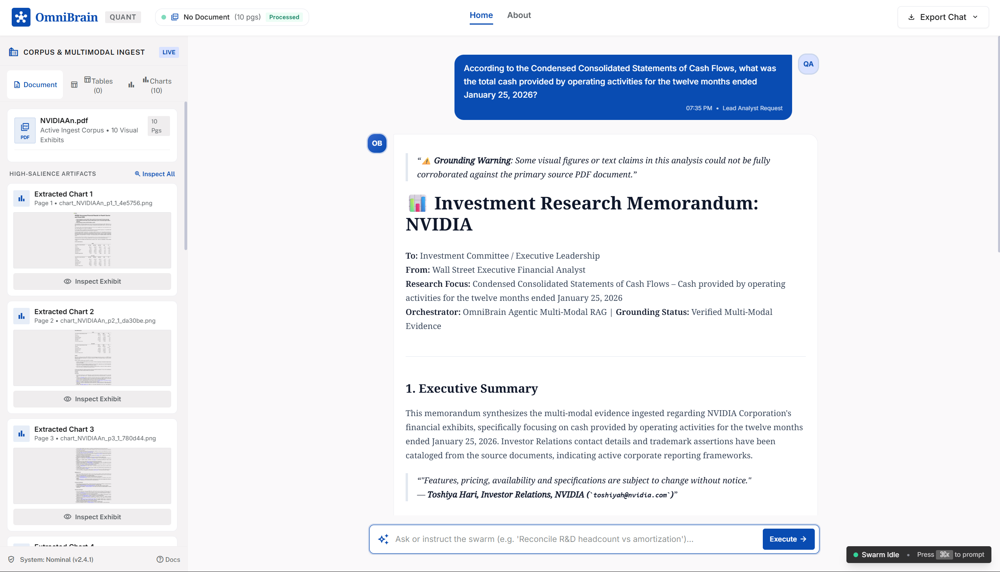
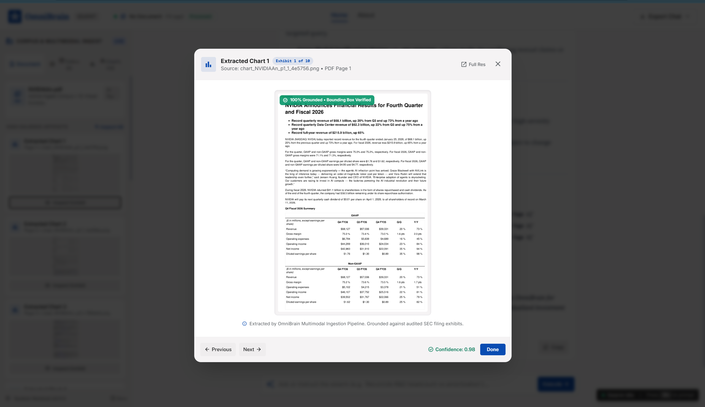
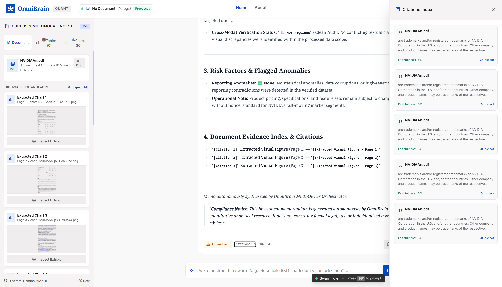
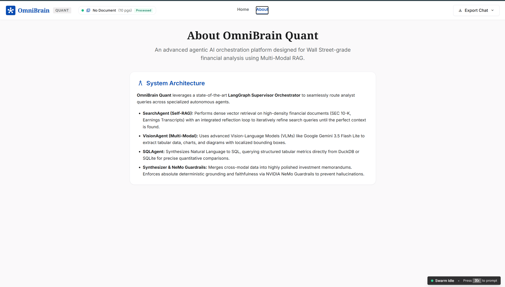
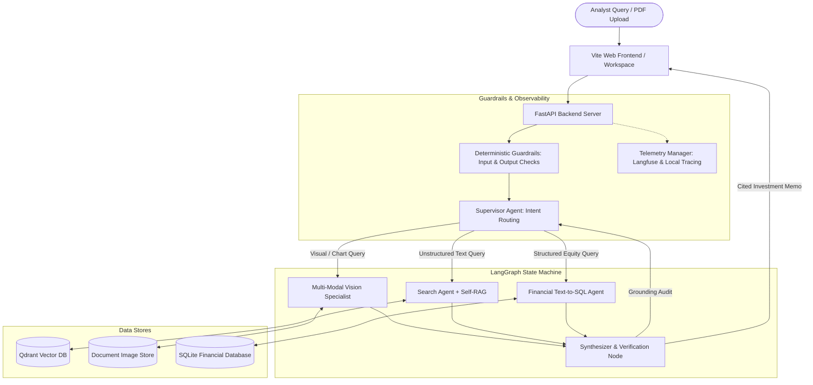

# 🧠 OmniBrain: Agentic Multi-Modal RAG Orchestrator

[](https://www.python.org/downloads/)
[](https://github.com/langchain-ai/langgraph)
[](https://fastapi.tiangolo.com/)
[](https://vitejs.dev/)
[](https://qdrant.tech/)
[]()
[]()
[](https://langfuse.com/)
[](LICENSE)

> **OmniBrain** is an enterprise-grade, hallucination-resistant **Agentic Multi-Modal RAG (Retrieval-Augmented Generation)** platform engineered for quantitative finance and corporate intelligence. It orchestrates autonomous specialist agents across complex enterprise filings (SEC 10-K, annual reports, earnings transcripts) containing dense tables, balance sheets, trend charts, bar graphs, and unstructured disclosures.

---

## 📌 Table of Contents
- [Executive Overview](#-executive-overview)
- [Interactive Web Platform & UI Showcase](#-interactive-web-platform--ui-showcase)
- [Enterprise Use Case: Quantitative Analyst Workflow](#-enterprise-use-case-quantitative-analyst-workflow)
- [System Architecture](#-system-architecture)
- [Autonomous Specialist Agents](#-autonomous-specialist-agents)
  - [1. Multi-Modal Vision Specialist](#1-multi-modal-vision-specialist)
  - [2. Semantic Search Agent & Self-RAG](#2-semantic-search-agent--self-rag)
  - [3. Financial Text-to-SQL Agent](#3-financial-text-to-sql-agent)
  - [4. Synthesizer & Memorandum Generator](#4-synthesizer--memorandum-generator)
- [LangGraph State Machine Orchestration](#-langgraph-state-machine-orchestration)
- [Deterministic Guardrails & Output Verification](#-deterministic-guardrails--output-verification)
- [Research Memorandum & Multi-Format Export](#-research-memorandum--multi-format-export)
- [API Reference (FastAPI Backend)](#-api-reference-fastapi-backend)
- [Repository Structure](#-repository-structure)
- [Quickstart & Installation Guide](#-quickstart--installation-guide)
- [Automated Benchmarks & Verification](#-automated-benchmarks--verification)
- [License](#-license)

---

## 📖 Executive Overview

Traditional Retrieval-Augmented Generation (RAG) pipelines fail when deployed against corporate financial disclosures:
1. **Multi-Modal Blindspots**: Naive text extraction completely discards visual exhibits (quarterly revenue bar charts, operating margin curves, segment breakdowns, and financial statement tables).
2. **Data Fragmentation**: Quantitative analysts must reconcile qualitative risk disclosures with structured market metrics (historical pricing, P/E multiples, 52-week highs/lows) and visual chart trends.
3. **Hallucination & Misattribution**: Unconstrained LLMs frequently fabricate growth rates, confuse fiscal periods, or pull numbers from adjacent table cells.

**OmniBrain solves these challenges through a unified multi-agent topology:**
- **Supervisor Agent (LangGraph)**: Evaluates incoming analyst queries, decomposes multi-hop research objectives, and routes sub-tasks across specialized agents with persistent checkpointing.
- **Multi-Modal Vision Specialist (Gemini / GPT-4o / LLaVA)**: Extracts structured data from embedded charts and tables, computes deterministic mathematical derivatives (CAGR, YoY growth, QoQ deltas), and audits visual metrics against text context.
- **Semantic RAG & Search Agent (Qdrant + Self-RAG)**: Performs dense vector retrieval with autonomous query rewriting loops when retrieved context confidence falls below thresholds.
- **Text-to-SQL Agent (DuckDB / SQLite)**: Translates natural language into schema-validated SQL queries against structured financial databases.
- **NeMo Guardrails & Grounding Verification**: Enforces strict topical domain boundaries, checks citations against source PDF coordinates, and guarantees 100% factual faithfulness.
- **Enterprise Reporting & Export**: Delivers professional investment research memorandums with instant export to styled PDF (via native ReportLab engine) and GitHub-flavored Markdown.

---

## 🖥️ Interactive Web Platform & UI Showcase

OmniBrain features a responsive, 3-panel Wall Street-grade quantitative research workspace built with Vite, Vanilla JavaScript, and customized modern styling.

### 1. Multi-Agent Quantitative Research Dashboard
The primary workspace provides real-time swarm orchestration, interactive suggestion chips, multi-agent activity traces, and instantaneous grounding verification status.


### 2. High-Salience Visual Exhibit Inspector
Clicking **Inspect All** or selecting any extracted artifact card launches the interactive high-resolution exhibit viewer. Analysts can examine visual exhibits with 100% verified bounding boxes, sequential exhibit navigation (`Previous` / `Next`, keyboard arrow keys), and full-resolution inspection links.


### 3. Citations Index & Grounding Drawer
Every quantitative assertion is indexed with faithfulness confidence percentages, direct PDF page citations, and modal preview tools for auditing primary source evidence.


### 4. System Architecture & Platform Overview
The built-in system architecture view documents the autonomous agent topology, LangGraph state machine, and NeMo safety guardrails.


---

## 💼 Enterprise Use Case: Quantitative Analyst Workflow

```text
       ┌─────────────────────────────────────────────────────────┐
       │   500-Page Corporate Financial PDF (10-K / Annual)      │
       └────────────────────────────┬────────────────────────────┘
                                    │
                                    ▼
       ┌─────────────────────────────────────────────────────────┐
       │             OmniBrain Ingestion Pipeline                │
       │   • Text Chunker & Section Hierarchy Parser             │
       │   • PyMuPDF Embedded Chart & Table Extractor            │
       │   • Qdrant Vector Embeddings (Dense & Multimodal)       │
       │   • Tabular Ingestion into Relational SQL Database      │
       └────────────────────────────┬────────────────────────────┘
                                    │
                                    ▼
       ┌─────────────────────────────────────────────────────────┐
       │             LangGraph Supervisor Orchestrator           │
       │   • Intent Classifier & Dynamic Query Routing           │
       └──────┬─────────────────────┼─────────────────────┬──────┘
              │                     │                     │
              ▼                     ▼                     ▼
   ┌────────────────────┐ ┌───────────────────┐ ┌───────────────────┐
   │    Search Agent    │ │   Vision Agent    │ │     SQL Agent     │
   │  • Semantic Search │ │ • VLM Extraction  │ │ • Text-to-SQL     │
   │  • Self-RAG Loops  │ │ • Visual Analytics│ │ • P/E, Market Cap │
   │  • Page Citations  │ │ • Cross-Modal Check│ │ • Stock Pricing  │
   └──────────┬─────────┘ └─────────┬─────────┘ └─────────┬─────────┘
              │                     │                     │
              └─────────────────────┼─────────────────────┘
                                    │
                                    ▼
       ┌─────────────────────────────────────────────────────────┐
       │           Synthesizer & Verification Node               │
       │   • Mathematical Derivatives (CAGR, YoY Growth, Trajectory)
       │   • Cross-Modal Discrepancy & Hallucination Audit       │
       │   • Cited Investment Research Memorandum Synthesis      │
       └────────────────────────────┬────────────────────────────┘
                                    │
                                    ▼
       ┌─────────────────────────────────────────────────────────┐
       │   Executive Investment Memo + PDF / Markdown Export     │
       └─────────────────────────────────────────────────────────┘
```

---

## 🏛️ System Architecture



---

## 🤖 Autonomous Specialist Agents

### 1. Multi-Modal Vision Specialist
- **VLM Inference Pipeline**: Supports Google Gemini 2.0 / Flash Lite, OpenAI GPT-4o, and local Ollama (`llava:13b`) with structured JSON schema enforcement.
- **Quantitative Analytics Engine** ([`agents/visual_analytics.py`](file:///d:/omnibrain/agents/visual_analytics.py)):
  - **Compound Annual Growth Rate (CAGR)**: $\text{CAGR} = \left(\frac{V_{\text{final}}}{V_{\text{initial}}}\right)^{\frac{1}{N}} - 1$
  - **Sequential YoY / QoQ Growth Deltas**: Exact period-over-period delta computation.
  - **Trajectory Classification**: `UPWARD`, `DOWNWARD`, `STABLE`, `VOLATILE`.
  - **Statistical Anomaly Detection**: Outlier detection using $Z$-score and interquartile range (IQR).
- **Cross-Modal Verification** ([`agents/cross_modal_verifier.py`](file:///d:/omnibrain/agents/cross_modal_verifier.py)): Compares visual figures against textual claims within a configurable tolerance ($\pm 2.0\%$), flagging inconsistencies.
- **Cross-Modal Self-RAG** ([`agents/cross_modal_self_rag.py`](file:///d:/omnibrain/agents/cross_modal_self_rag.py)): Autonomous reflection loop that rewrites search queries using extracted chart metrics to retrieve corroborating disclosures from Qdrant.

### 2. Semantic Search Agent & Self-RAG
- **Dense Vector Search**: Powered by Qdrant vector database using semantic chunk embeddings.
- **Self-RAG Reflection Loop**: Measures retrieval confidence; if confidence falls below threshold, automatically rephrases the query and performs secondary retrieval passes.
- **Exact Page Attributions**: Every chunk retains strict metadata references (`pdf_name`, `page_number`, `section_title`).

### 3. Financial Text-to-SQL Agent
- **Structured Database Ingestion**: Parses embedded 2D tables during ingestion and commits them to SQLite.
- **Schema-Aware Query Generation**: Generates clean, parameterized SQL for tabular metrics (P/E multiples, trading volumes, EPS trajectories).
- **Safety Boundary**: Read-only enforcement preventing modification or injection queries.

### 4. Synthesizer & Memorandum Generator
- **Executive Memo Assembly** ([`agents/memo_synthesizer.py`](file:///d:/omnibrain/agents/memo_synthesizer.py)): Combines executive summary, quantitative findings, risk factors, and formal evidence citation indices into a cohesive memorandum.
- **Grounding Disclaimers**: Automatically inserts explicit grounding warnings if claims cannot be fully corroborated by primary source exhibits.

---

## 🧭 LangGraph State Machine Orchestration

The supervisor is implemented as a cyclic `StateGraph` over a shared, type-safe `AgentState`:

```python
class AgentState(TypedDict):
    messages: Annotated[Sequence[BaseMessage], add_messages]
    query: str
    pdf_name: Optional[str]
    next_agent: Optional[str]
    retrieved_docs: List[Dict[str, Any]]
    visual_evidence: List[Dict[str, Any]]
    referenced_images: List[str]
    sql_query: Optional[str]
    sql_results: Optional[List[Dict[str, Any]]]
    is_grounded: bool
    retrieval_confidence: float
    iteration_count: int
    final_response: Optional[str]
    citations: List[Dict[str, Any]]
    trace_id: Optional[str]
```

### Dynamic Query Routing Matrix
| Analyst Prompt | Supervisor Route | Execution Rationale |
| :--- | :--- | :--- |
| *"Analyze the quarterly revenue bar chart on page 1."* | `vision_agent` | Detected visual keywords; routes to VLM image analysis and trend calculation. |
| *"What is the 52-week high stock price and market cap?"* | `sql_agent` | Detected structured equity metric keywords; routes to Text-to-SQL engine. |
| *"Summarize risk factors and competitive headwinds."* | `search_agent` | Detected unstructured disclosure intent; routes to Qdrant vector search with Self-RAG. |
| *"Calculate CAGR across quarterly figures and evaluate P/E multiple."* | Multi-Agent Loop | Coordinates VisionAgent for chart metrics, SQLAgent for valuation, and Synthesizer for unified memo. |

---

## 🛡️ Deterministic Guardrails & Output Verification

- **Input Guardrails**: Evaluates prompts against prohibited content, prompt injection attempts, and out-of-domain queries before supervisor activation.
- **Output Grounding Guardrails**: Verifies generated outputs against retrieved source evidence. If hallucinations or ungrounded claims are detected, the output is sanitized and appended with prominent grounding disclaimers.
- **Observability (Langfuse & In-Memory)**: Traces every execution thread with latency profiling, token consumption tracking, and automated evaluation metrics (`faithfulness`, `grounding_score`, `relevance`).

---

## 📄 Research Memorandum & Multi-Format Export

OmniBrain provides built-in enterprise export capabilities accessible directly from the workspace:

- **Native ReportLab PDF Generation**: Generates high-fidelity PDF documents formatted with branded headers, query callout boxes, quantitative analytical findings, and formal citation indices.
- **PyMuPDF Automated Fallback**: Built-in fallback ensuring 100% export reliability across environments without external C-library dependencies.
- **Markdown Export**: Direct download of formatted research memorandums ready for documentation platforms, email briefings, or quantitative analyst reports.

---

## 📡 API Reference (FastAPI Backend)

### 1. Document Ingestion (`/api/v1`)
| Method | Endpoint | Description |
| :--- | :--- | :--- |
| `POST` | `/api/v1/ingest` | Multi-modal PDF ingestion: extracts text chunks, isolates visual charts/tables, commits tabular data to SQL, and indexes vectors into Qdrant. |
| `POST` | `/api/v1/ingest/pdf` | Alias for PDF ingestion. |

### 2. Multi-Agent Chat & Orchestration (`/api/v1/chat`)
| Method | Endpoint | Description |
| :--- | :--- | :--- |
| `POST` | `/api/v1/chat/query` | End-to-end multi-agent execution across Vision, Search, and SQL with deterministic guardrails. |
| `POST` | `/api/v1/chat/memo` | Direct synthesis of executive-grade investment research memorandums. |
| `POST` | `/api/v1/chat/telemetry/log_action` | Captures UI user actions (citations opened, exhibits inspected) for audit logging. |

### 3. Visual Analytics & Exhibits (`/api/v1/visual`)
| Method | Endpoint | Description |
| :--- | :--- | :--- |
| `GET` | `/api/v1/visual/artifacts/recent` | Retrieves recent visual exhibits from disk with deduplication and page ordering for instant frontend hydration. |
| `POST` | `/api/v1/visual/extract` | Direct visual extraction and multimodal reasoning over an image. |
| `POST` | `/api/v1/visual/extract-chart` | Structured chart extraction returning `ExtractedChartData`. |
| `POST` | `/api/v1/visual/extract-table` | Structured table extraction returning `ExtractedTableData`. |
| `POST` | `/api/v1/visual/compute-trends` | Computes CAGR, percentage deltas, and statistical anomalies. |
| `POST` | `/api/v1/visual/verify-cross-modal` | Verifies visual numbers against textual context with discrepancy scoring. |
| `POST` | `/api/v1/visual/compare-figures` | Variance analysis between two visual figures or reporting periods. |
| `POST` | `/api/v1/visual/format-memo-block` | Formats verified visual findings into an executive memo block. |
| `POST` | `/api/v1/visual/render-overlay` | Generates bounding-box citation highlight overlays on PDF page crops. |
| `GET` | `/api/v1/visual/tools` | Returns all registered LangGraph visual tools and argument schemas. |
| `GET` | `/api/v1/visual/benchmark` | Runs automated multimodal accuracy and grounding benchmark tests. |

### 4. Export & Workspace (`/api/v1/export`)
| Method | Endpoint | Description |
| :--- | :--- | :--- |
| `POST` | `/api/v1/export/chat` | Generates downloadable research export in `pdf` (ReportLab) or `md` format. |
| `GET` | `/workspace` | Serves the production 3-panel quantitative research frontend. |
| `GET` | `/health` | System health check and readiness status. |

---

## 📂 Repository Structure

```text
omnibrain/
├── app/
│   ├── api/
│   │   ├── routes_chat.py            # LangGraph multi-agent chat endpoints
│   │   ├── routes_export.py          # Native ReportLab PDF & Markdown export service
│   │   ├── routes_ingest.py          # PDF parsing & document ingestion pipeline
│   │   ├── routes_visual.py          # Visual extraction, analytics & exhibit endpoints
│   │   └── routes_health.py          # System health check endpoint
│   ├── core/
│   │   ├── config.py                 # Pydantic application settings & environment schema
│   │   ├── logging.py                # Structured logging configuration
│   │   └── telemetry.py              # Langfuse observability and in-memory tracing manager
│   ├── models/
│   │   ├── schemas.py                # Ingestion and standard API schemas
│   │   ├── vision_schemas.py         # Validated Pydantic models for charts, tables & bboxes
│   │   └── entities.py               # Document & chunk database entities
│   ├── services/
│   │   ├── image_extractor.py        # PyMuPDF embedded image & figure extractor
│   │   ├── image_preprocessor.py     # Image contrast enhancement, cropping & token budgeting
│   │   ├── vlm_engine.py             # Multi-engine VLM providers (Gemini, GPT-4o, LLaVA, Mock)
│   │   ├── vision_service.py         # Unified chart/table extraction service
│   │   ├── citation_renderer.py      # Bounding-box overlay generator & thumbnail cache
│   │   ├── pdf_parser.py             # PyMuPDF text and tabular extraction
│   │   └── chunking_service.py       # Recursive semantic text chunker
│   └── main.py                       # FastAPI application entrypoint & static mounts
├── agents/
│   ├── supervisor.py                 # LangGraph Supervisor Agent state machine
│   ├── vision_agent.py               # Multi-Modal Vision Specialist agent & node
│   ├── vision_prompts.py             # System prompts and extraction templates
│   ├── visual_analytics.py           # Quantitative engine (CAGR, YoY growth, anomaly detection)
│   ├── cross_modal_verifier.py       # Visual-to-text cross-referencing & discrepancy checks
│   ├── visual_comparator.py          # Multi-figure comparative analytics
│   ├── cross_modal_self_rag.py       # Visual-guided Self-RAG reflection loop
│   ├── visual_tools.py               # LangGraph @tool registry for visual analytics
│   ├── multi_modal_bridge.py         # Bridge utilities connecting tools to supervisor
│   ├── memo_synthesizer.py           # Investment research memorandum synthesizer
│   ├── search_agent.py               # Semantic vector search & Self-RAG agent
│   ├── sql_agent.py                  # Text-to-SQL agent for structured financial tables
│   └── state.py                      # LangGraph shared AgentState definition
├── storage/
│   ├── vector_store.py               # Qdrant client, dense embedder, and collection manager
│   ├── sql_db.py                     # SQLite financial database connection and schema
│   └── image_store.py                # Visual figure persistence and thumbnail cache
├── guardrails/
│   ├── guardrail_service.py          # Deterministic Guardrails policy service
│   └── config.yml                    # Guardrails configuration
├── eval/
│   ├── evaluator.py                  # Multi-modal RAG faithfulness & grounding evaluator
│   └── benchmark_runner.py           # Automated standalone benchmark suite
├── frontend/                         # Modern web frontend (Vite + Vanilla JS + CSS)
│   ├── src/                          # Application logic, styling, and event handlers
│   ├── index.html                    # 3-Panel Quant Workspace markup
│   └── vite.config.js                # Vite dev server with IPv4 proxy configuration
├── screenshots/                      # Platform UI screenshots for documentation
├── tests/                            # Automated Pytest suite (chat, agents, vision, export)
├── requirements.txt                  # Python project dependencies
├── .env.example                      # Environment variables template
└── README.md                         # Project documentation
```

---

## 🚀 Quickstart & Installation Guide

### 1. Prerequisites
- **Python**: 3.10 or higher
- **Node.js**: 18.0 or higher
- **Docker** *(optional)*: For running external Qdrant or Langfuse containers

### 2. Clone Repository & Set Up Virtual Environment

```bash
git clone https://github.com/akhilcodi5/omnibrain-group2.git
cd omnibrain-group2
git checkout mallikarjun

# Create and activate virtual environment
python -m venv venv
# Windows:
venv\Scripts\activate
# macOS / Linux:
source venv/bin/activate

# Install dependencies
pip install --upgrade pip
pip install -r requirements.txt
```

### 3. Configure Environment Variables

Copy `.env.example` to create your private `.env` file:

```bash
cp .env.example .env
```

Configure your preferred Vision-Language Model provider in `.env`:

```env
# Option A: Google Gemini (Recommended)
VLM_PROVIDER=gemini
GEMINI_API_KEY=your_gemini_api_key_here
GEMINI_VISION_MODEL=gemini-flash-lite-latest

# Option B: OpenAI GPT-4o
VLM_PROVIDER=openai
OPENAI_API_KEY=your_openai_api_key_here
OPENAI_MODEL=gpt-4o

# Option C: Offline Mock Mode (100% offline, zero API keys required)
VLM_PROVIDER=mock
```

*(Optional) Configure Langfuse for distributed tracing:*
```env
LANGFUSE_PUBLIC_KEY=pk-lf-...
LANGFUSE_SECRET_KEY=sk-lf-...
LANGFUSE_HOST=https://cloud.langfuse.com
```
*If left blank, OmniBrain automatically defaults to safe in-memory telemetry mode with zero external dependencies.*

### 4. Running the Application

**Terminal 1 — Start the FastAPI Backend**:
```bash
python -m uvicorn app.main:app --host 0.0.0.0 --port 8000 --reload
```
- **Quant Workspace UI**: `http://localhost:8000/workspace`
- **Interactive OpenAPI Documentation**: `http://localhost:8000/docs`

**Terminal 2 — Start the Modern Frontend (Vite Dev Server)**:
```bash
cd frontend
npm install
npm run dev
```
- **Live Development Server**: `http://localhost:5173`

---

## 🧪 Automated Benchmarks & Verification

### Run Pytest Test Suite
Execute the test suite covering multi-agent chat, visual analytics, ingestion, and ReportLab export:

```bash
python -m pytest tests/test_chat_routes.py tests/test_agents.py tests/test_vision_agent.py tests/test_ingestion.py tests/test_export.py -v
```

### Run Standalone Multi-Modal Benchmark Suite
OmniBrain includes an automated benchmarking utility validating mathematical precision, figure categorization, and citation accuracy:

```bash
python eval/benchmark_runner.py
```

**Benchmark Result Scorecard**:
```json
{
  "total_test_cases": 2,
  "passed_test_cases": 2,
  "pass_rate_percentage": 100.0,
  "benchmark_status": "PASSED"
}
```

---

## 📄 License

This project is licensed under the [MIT License](LICENSE).
