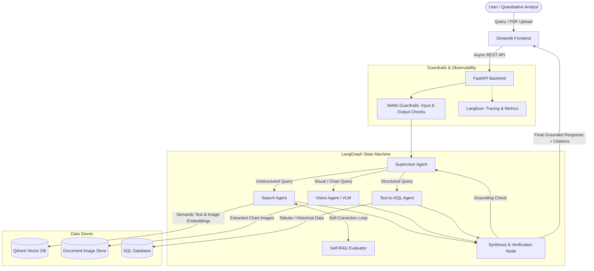

# 🧠 OmniBrain: Agentic Multi-Modal RAG Orchestrator

[](https://www.python.org/downloads/)
[](https://github.com/langchain-ai/langgraph)
[](https://fastapi.tiangolo.com/)
[](https://streamlit.io/)
[](https://qdrant.tech/)
[](https://github.com/NVIDIA/NeMo-Guardrails)
[](https://langfuse.com/)

> **An enterprise-grade, hallucination-resistant Agentic Multi-Modal RAG system** engineered for complex reasoning over unstructured documents (PDFs, embedded charts, financial tables) and structured data silos.

---

## 📌 Table of Contents
- [Overview & Problem Statement](#-overview--problem-statement)
- [Enterprise Use Case](#-enterprise-use-case)
- [Key Features](#-key-features)
- [System Architecture](#-system-architecture)
- [Tech Stack](#-tech-stack)
- [Repository Structure](#-repository-structure)
- [Quickstart Guide](#-quickstart-guide)
  - [Prerequisites](#prerequisites)
  - [Environment Configuration](#environment-configuration)
  - [Installation & Execution](#installation--execution)
- [4-Week Development Plan](#-4-week-development-plan)
- [Evaluation, Observability & Guardrails](#-evaluation-observability--guardrails)
- [License](#-license)

---

## 📖 Overview & Problem Statement

Standard Retrieval-Augmented Generation (RAG) pipelines break down when applied to complex enterprise documents:
1. **Multi-Modal Blindspots**: Conventional chunking strips out or garbles visual context such as balance sheet tables, trend charts, bar graphs, and diagrams.
2. **Siloed Reasoning**: User queries frequently require cross-referencing unstructured document content with structured databases (e.g., historical stock prices or ERP records).
3. **Single-Hop Limitations**: Standard vector search cannot perform multi-step planning, iterative query rewriting, or validation across diverse sources.

**OmniBrain** solves these challenges by combining a **LangGraph-powered Supervisor Agent**, **Multi-Modal Vector Embeddings (CLIP + Text)**, **Vision-Language Models (VLM)**, and a **Text-to-SQL Agent** in an autonomous self-correcting loop.

---

## 💼 Enterprise Use Case

```text
[500-Page Corporate Financial PDF]
                │
                ▼
      ┌──────────────────┐
      │    OmniBrain     │ ──► Dynamic Task Decomposition
      │    Orchestrator  │
      └──────────────────┘
         │        │       │
         ▼        ▼       ▼
   [Text Vector] [VLM] [Text-to-SQL]
         │        │       │
         └────────┼───────┘
                  │
                  ▼
   [Cited Investment Memo with Exact Page & Chart Evidence]
```

**Scenario**: A quantitative analyst ingests a 500-page corporate financial report. 
- The **Supervisor Agent** breaks the prompt into sub-tasks.
- The **Vision Agent** extracts key performance indicators from embedded quarterly charts.
- The **Search Agent** retrieves qualitative risk factors from semantic text chunks.
- The **SQL Agent** queries historical trading and pricing data from a SQL database.
- The agents collaboratively synthesize findings into an **investment memo with visual citations**, eliminating hallucinations through NeMo Guardrails and Self-RAG verification.

---

## ✨ Key Features

- 🤖 **LangGraph Supervisor Orchestration**: State-machine-based multi-agent coordination with specialized workers (Search, SQL, Vision).
- 🖼️ **Multi-Modal Document Parsing**: Dual ingestion pipeline extracting text chunks, tables, and images/charts using CLIP embeddings and VLM reasoning (GPT-4o / LLaVA).
- 🔄 **Self-Correction (Self-RAG / CRAG)**: Evaluates retrieval relevance; autonomously rewrites queries and re-fetches context if initial retrieval confidence is low.
- 🛡️ **NeMo Safety Guardrails**: Domain-boundary enforcement to prevent prompt injection and out-of-domain hallucinations.
- 📊 **Full-Stack Observability with Langfuse**: Real-time tracing of agent state transitions, token consumption, latency, and reasoning pathways.
- 🖥️ **Interactive Streamlit UI**: Visualizes agent thought processes, step-by-step reasoning logs, and clickable image/page citation links.

---

## 🏛️ System Architecture



---

## 🛠️ Tech Stack

| Domain | Technology / Library | Purpose |
| :--- | :--- | :--- |
| **Agent Orchestration** | [LangGraph](https://github.com/langchain-ai/langgraph), [LangChain](https://www.langchain.com/) | Cyclic state graphs, supervisor-worker routing, and memory |
| **Multi-Modal Models** | GPT-4o / LLaVA, CLIP | Multimodal visual reasoning and cross-modal embedding |
| **Vector Store** | [Qdrant](https://qdrant.tech/) / FAISS | High-performance vector similarity search (dense + multimodal) |
| **Relational Database** | PostgreSQL / SQLite (SQLAlchemy) | Structured historical financial and stock data |
| **Safety & Policy** | [NVIDIA NeMo Guardrails](https://github.com/NVIDIA/NeMo-Guardrails) | Hallucination mitigation, topical rail enforcement |
| **LLMOps & Tracing** | [Langfuse](https://langfuse.com/) | Trace tracking, latency/cost telemetry, and evaluation |
| **Backend API** | [FastAPI](https://fastapi.tiangolo.com/), Uvicorn, Pydantic | Asynchronous document ingestion and agent query endpoints |
| **Frontend UI** | [Streamlit](https://streamlit.io/) | Interactive analyst dashboard, thought-process visualization |
| **Document Processing**| PyMuPDF, pdfplumber, Pillow | PDF parsing, table extraction, and image slicing |

---

## 📂 Repository Structure

```text
omnibrain/
├── app/
│   ├── api/                     # FastAPI route handlers (ingestion, chat, health)
│   ├── core/                    # App configuration, logging, and security
│   ├── models/                  # Pydantic schemas and database models
│   ├── services/                # Ingestion services, PDF parser, and chunkers
│   └── main.py                  # FastAPI application entrypoint
├── agents/
│   ├── supervisor.py            # LangGraph Supervisor Agent routing logic
│   ├── search_agent.py          # Vector retrieval & Self-RAG query rewriter
│   ├── vision_agent.py          # VLM chart/table extraction agent
│   ├── sql_agent.py             # Text-to-SQL generator and executor
│   └── state.py                 # LangGraph AgentState definitions
├── guardrails/
│   ├── config.yml               # NeMo Guardrails configuration
│   └── rails/                   # Colang flow definitions (.co)
├── storage/
│   ├── vector_store.py          # Qdrant client and collection manager
│   ├── sql_db.py                # SQL database connection and schema
│   └── image_store.py           # Extracted image/chart asset persistence
├── ui/
│   ├── app.py                   # Streamlit web application
│   ├── components/              # UI widgets (citation viewer, thought trace)
│   └── styles.css               # Streamlit custom styling
├── tests/
│   ├── test_ingestion.py        # PDF & image ingestion tests
│   ├── test_agents.py           # LangGraph agent routing unit tests
│   └── test_guardrails.py       # NeMo safety rails verification
├── docker-compose.yml           # Multi-container setup (API, Qdrant, UI, Langfuse)
├── Dockerfile                   # Application Docker image definition
├── requirements.txt             # Python dependencies
├── .env.example                 # Environment variables template
└── README.md                    # Project documentation
```

---

## 🚀 Quickstart Guide

### Prerequisites
- Python 3.10 or higher
- [Docker & Docker Compose](https://www.docker.com/) (for Qdrant & Langfuse)
- OpenAI API Key (or equivalent multimodal LLM provider)

### Environment Configuration

Clone the repository and copy the environment template:

```bash
git clone https://github.com/your-org/omnibrain.git
cd omnibrain
cp .env.example .env
```

Populate the `.env` file with your credentials:

```env
# LLM & Vision Providers
OPENAI_API_KEY=your_openai_api_key
OPENAI_MODEL=gpt-4o

# Qdrant Vector Database
QDRANT_HOST=localhost
QDRANT_PORT=6333
QDRANT_COLLECTION_NAME=omnibrain_docs

# SQL Database
DATABASE_URL=sqlite:///./storage/financial_data.db

# Langfuse Observability
LANGFUSE_PUBLIC_KEY=your_langfuse_public_key
LANGFUSE_SECRET_KEY=your_langfuse_secret_key
LANGFUSE_HOST=https://cloud.langfuse.com

# Application Settings
BACKEND_HOST=0.0.0.0
BACKEND_PORT=8000
```

### Installation & Execution

1. **Start Infrastructure Services (Qdrant & Langfuse)**:
   ```bash
   docker-compose up -d qdrant
   ```

2. **Install Python Dependencies**:
   ```bash
   python -m venv venv
   # Windows
   venv\Scripts\activate
   # Linux/macOS
   source venv/bin/activate

   pip install --upgrade pip
   pip install -r requirements.txt
   ```

3. **Launch the FastAPI Backend**:
   ```bash
   uvicorn app.main:app --host 0.0.0.0 --port 8000 --reload
   ```
   *Interactive API docs available at `http://localhost:8000/docs`*

4. **Launch the Streamlit Frontend**:
   ```bash
   streamlit run ui/app.py
   ```
   *Access the web UI at `http://localhost:8501`*

---


## 🛡️ Evaluation, Observability & Guardrails

- **Grounding Verification**: Synthesizer node evaluates generated responses against retrieved context before presenting them to the user.
- **Topical Rails**: NeMo Guardrails configuration enforces domain adherence and suppresses prompt leakage.
- **Telemetry & Tracing**: All LangGraph state transitions and LLM calls are traced in Langfuse for real-time debugging and evaluation.

---

## 📄 License

This project is licensed under the [MIT License](LICENSE).
